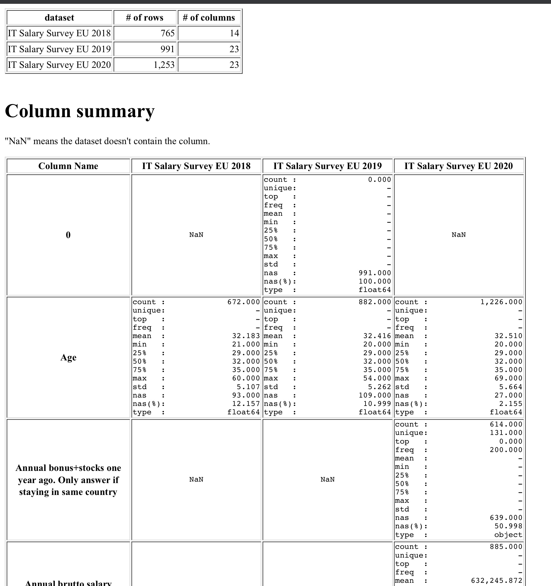
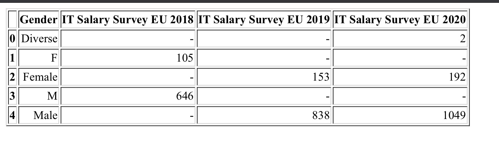

When data is provided with separate files, it is often the case that they slightly differs in their column names, data types, levels of categorical columns, etc.
This scripts helps you to find what are the differences between them.

### Input
[IT Salary Survey for EU region](https://www.kaggle.com/parulpandey/2020-it-salary-survey-for-eu-region) datasets are used as this script's inputs.   
You need to modify the "Read datasets" block of the code according to your inputs.

### Output
The following HTML files will be created in the [outputs](./outputs) directory. 
1. [_summary.html](./outputs/_summary.html) : Summary of differences between datasets.
2. {*column-name*}.html : Difference in the levels of a categorical column.

Image: **_summary.html**

Image: **Gender.html**
