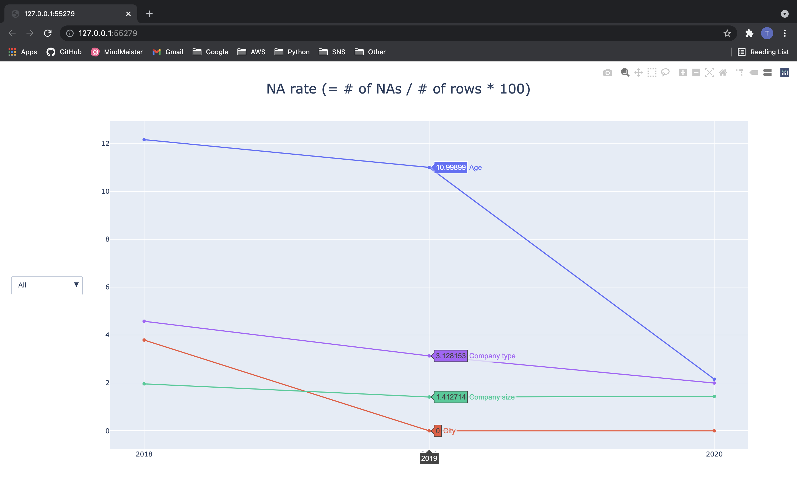
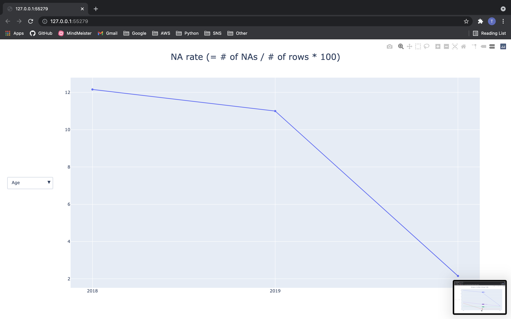

A snippet to check how NA rate of each column in a dataset changes over time.

### Input
[IT Salary Survey for EU region](https://www.kaggle.com/parulpandey/2020-it-salary-survey-for-eu-region) datasets are used as this script's inputs.   
You need to modify the "Read datasets" block of the code according to your inputs.

### Output
The output is a Plotly html file ([output.html](./output.html)). 
Use this [website](https://htmlpreview.github.io/) to preview the html file.  
You can filter lines using the dropdown menu on the left.

